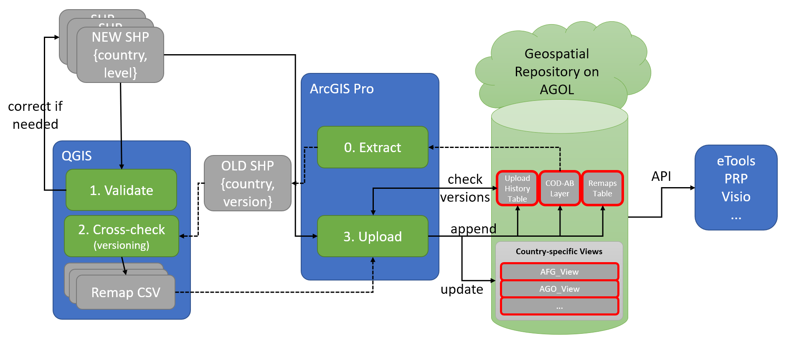

# UNICEF Geospatial Data Repository on ArcGIS Online

## Overview

UNICEF requires a corporate, central geospatial data repository. The primary focus is on central repository of admin boundaries.This document describes the concepts of using ArcGIS Online \(AGOL\) as UNICEF Geospatial Data Repository \(GDR\). The key objective is to have a single point of truth for admin boundaries so that all UNICEF corporate systems can use the same geospatial reference data. This will help ensure data interoperability between systems, reduce data redundancy, facilitate the geoenabling of existing corporate systems and reduce the overall costs of data maintenance.

Due to the technical limitations of ArcGIS Online, the AGOL version of the GDR needs to be regarded as a temporary, short-term solution. The key benefits of using AGOL are:

* direct integration with the Esri stack \(including desktop apps, web maps, story maps, web dashboards\),
* data is available via API,
* cloud-based infrastructure - no need for costly deployments.

The main constraints of using AGOL are:

* limited validation capabilities,
* no built-in or system-enforced versioning,
* no backups, roll-back etc,
* limited relational table,
* performance,
* potential costs of extra storage \(credit-based pay-as-you-go approach\).

## Assumptions

* Datasets are updated per country, for all admin levels \(e.g. Sudan lev 0-1-2-3\) 
* In case updates \(changes\) affects only selected levels, all other unchanged levels must be provided for consistency 
* One INPUT admin level dataset is stored in one shapefile / ArcGIS Feature Layer 
* UUIDs need to be generated for all new features 
* Hierarchy generated using Pcodes on import but stored in the DB using UUIDs
* Admin levels need to be uploaded from level 0 to lower levels 
* Level Type shall be added to the shapefile / dataset for all features \(ADM0\_TYPE\) 
* UNICEF needs to maintain its own repository of admin boundaries, not always COD-ABs / OCHA will have a suitable datasets. Preference will be for country office / internal datasets 
* No data can be deleted once imported into Master Database

## General workflow: validate and upload new datasets

The following diagram shows a general data workflow.

All data is stored on AGOL in the COD\_Admin\_Boundaries\_Repository\_MASTER Feature Layer \(hosted\), which contains one \(1\) Layer and two \(2\) Tables:

1. **Layer "cod\_admin\_boundaries\_MASTER"**, which contains all admin boundaries \(archived and active, for all countries and admin levels\). All admin boundaries must by polygons in WGS84 \(EPSG:4326\) coordinate system.
2. **Table "tbl\_upload\_history\_MASTER"**, which contains the history of data uploads.
3. **Table "tbl\_remap\_history\_MASTER"**, which contains the history of remaps.

Additionally, View Layers are created for each country, that contain the active admin boundaries for all available admin levels for a given country, e.g.:

* "AGO\_View" - a Feature Layer \(hosted, view\) containing most up-to-date admin boundaries for Angola,
* "BOL\_View" - a Feature Layer \(hosted, view\) containing most up-to-date admin boundaries for Bolivia,

## Validations

### Validations per admin level

* Duplicated Pcodes within admin level
* Invalid geometries
* Spatial overlaps

### Cross-level validations

* Check if parent pcodes exist
* Check if parent pcodes match spatially

## Remapping concepts

Remapping approach is implemented as a versioning mechanism. The general idea is that once the new version of the dataset for a given country and admin level is uploaded, all previous \(old version\) locations are matched with \(remapped to\) **exactly one location** in a new dataset. 

The current matching algorithm works as follows:

1. Iterate through all "source" admin boundaries \(for a given country and admin level\)
2. Get the "source" admin boundary
3. Find the admin boundaries in the "target" dataset that intersect with the bounding box \(envelope\) of the "source" admin boundary
4. Intersect "source" AB with Nearest Neighbor Admin Boundaries
5. Calculate the similarity of names between "source" and "target" AB
6. Calculate the percentage of spatial overlap using two measures:
   1. Percentage of the "intersecting" area comparing to the "source" boundary
   2. Percentage of the "intersecting" area comparing to the "target" boundary
7. Select the "target" admin boundary that  has the highest spatial overlap AND the highest name similarity.
8. In case no intersecting "target" features are found, find the "target" admin boundary, which is closest to the "source" admin boundary.

 

### Calculating spatial overlaps

### Output of the remapping

The final output of the remapping is a list of all "source" \(old\) admin boundaries for each admin level with one matching "target" admin boundary.

## Implementation of versioning

The following diagrams represents the scenario with 3 subsequent versions of admin boundaries uploaded to the GDR.

### Version 1 uploaded

Notes:

* In version 1 there are two admin boundaries \(\#1 and \#2\)
* Intervention \#1 is referenced to AB \#2

### Version 2 uploaded

Notes:

* version 2 is uploaded with just one AB \(\#3\) - "old" ABs \#1 and \#2 got merged into one AB
* both AB \#1 and \#2 are matched to the new AB \#3
* in the Internal Platform \(e.g. eTools\), both the original AB \(\#2\) and the matching active AB \(\#3\) are recorded for the Intervention \#1. This intervention can be therefore mapped on the current admin boundary map, but the original reference is still preserved

### Version 3 uploaded

Notes:

* version 3 is uploaded with two admin boundaries \(\#4 and \#5\) - previous AB \#3 was split into two ABs
* all previous locations for this country and admin level \(i.e. ABs \#1 and \#2 from version 1 and AB \#3 from version 2\) are remapped to version 3. 
* intervention \#1, originally referenced to AB \#2 is now remapped with AB \#5, while the intervention \#2, originally referenced to AB \#3 is now remapped to AB \#4.

